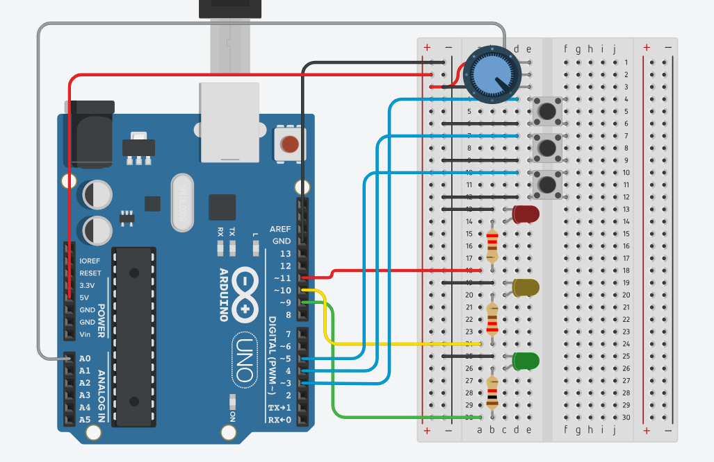

신호등 구현을 위해 빨간, 노란, 초록 총 3개의 LED가 사용되었고 각각의 LED는 9번, 10번, 11번 핀에 연결되어 있습니다. 그 다음은 빨간불만 계속 켜져있는 Emergency 상태, 모든 LED가 깜빡거리는 Blinking 상태, 기본 기능을 껐다 켜는 On/Off 상태 총 3가지 상태 변화를 위해 스위치 3개를 각 3번, 4번, 5번에 연결했습니다. 마지막으로 LED 밝기 세기 조절을 위해 가변저항을 준비하였고, 가변 저항은 A0핀에 연결했습니다.

Arduino

Task 1: 주기적으로 LED를 켭니다. 이 주기는 Taskscheduler를 통해 제어합니다.

  기본적으로 빨강 (2초) -> 노랑 (0.5초) -> 초록(2초 동작 후 1초 동안 3번 블링크) -> 노랑 (0.5초) 사이클을 무한 반복합니다.
  
Task 2: 빨간 LED 계속 켜지는 Emergency Mode, 모든 LED 동시에 깜빡거리는 Blinking Mode, Power On/Off Mode 총 3가지 모드를 버튼을 통해 제어합니다.
  이때 버튼은 Interrupt 함수를 활용하여 제어합니다.
  
Task 3: 기본 동작 모드, 세 가지 모드에서 LED 밝기 조절을 할 수 있도록 가변 저항을 연결하고 이를 아날로그 신호 제어를 통해 조절합니다.

------------------------------------------------------------------------------------------------------------------------------------------------------------

p5.js

아두이노에서 전송한 시리얼 메시지를 Web Serial 인터페이스를 통해 모니터링합니다.

받은 메시지를 캔버스에 표시합니다.

Traffic Light Mode에선 각각의 신호등 상태를 나타냅니다
  NOMAL : 기본 동작 상태, Red Mode : 빨간 LED 계속 켜지는 Emergency 상태, Blink Mode : 모든 LED가 깜빡거리는 상태, Power On/Off : 신호등 꺼지고 켜짐 조절
  
Current LED에선 현재 활성화 중인 LED의 색깔을 텍스트로 표시하고 그 아래에 있는 원에선 현재 활성화 되고 있는 LED 색깔을 표시합니다.

Brightness에선 현재 LED의 밝기 정도를 0~255사이의 값으로 표시합니다.

슬라이더를 이용해 LED의 깜빡이는 주기를 조절하고, 해당 값을 시리얼 포트를 통해 아두이노로 전송합니다.
